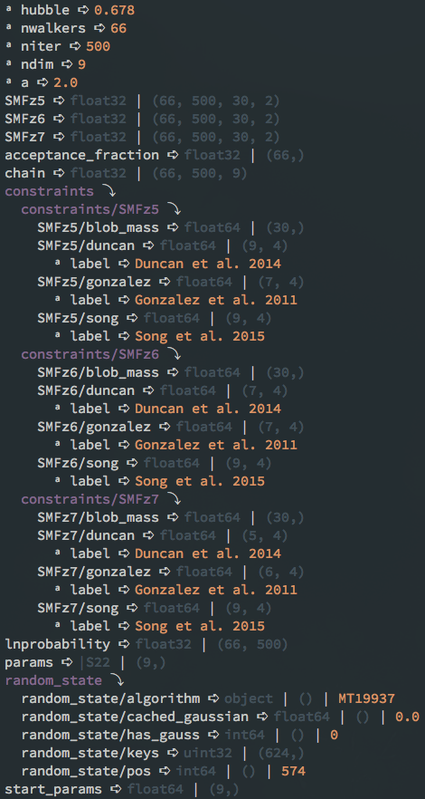

h5dir
=====

    Pretty print the entire layout of an hdf5 file, including attributes.

`h5ls` and `h5dump` are great when you know what you are looking for, however, I 
find them difficult to use when I am searching for the location of things like 
attributes.  **h5dir** just gives a nice, compact, high-level overview of an 
hdf5 file to help with this.

* Free software: MIT license

Installation
------------

**h5dir** can be installed using:

.. code-block:: sh

    pip install git+https://github.com/smutch/h5dir.git

Usage
-----

.. code-block:: sh

    h5dir FNAME

Example output
--------------

Credits
-------

Code written by Simon Mutch (smutch).

This package was created with Cookiecutter_ and the 
`audreyr/cookiecutter-pypackage`_ project template.

.. _Cookiecutter: https://github.com/audreyr/cookiecutter
.. _`audreyr/cookiecutter-pypackage`: https://github.com/audreyr/cookiecutter-pypackage
